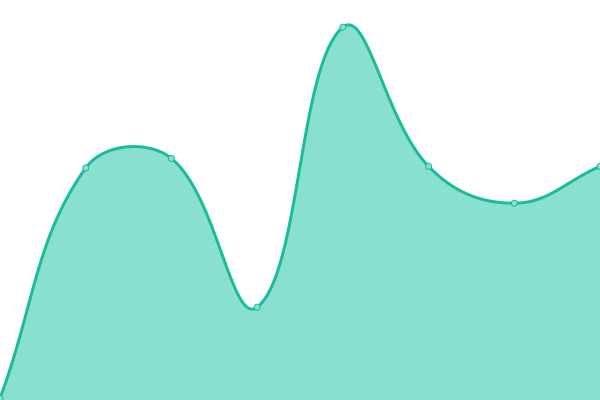
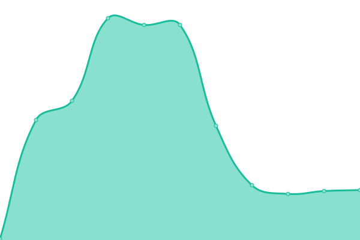
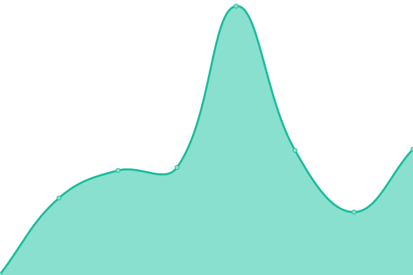

# [📈 Live Status](https://gigapipehq.github.io/upptime): <!--live status--> **🟩 All systems operational**

This repository contains the open-source uptime monitor and status page for [Gigapipe](https://gigapipe.com), powered by [Upptime](https://github.com/upptime/upptime).

With [Upptime](https://upptime.js.org), you can get your own unlimited and free uptime monitor and status page, powered entirely by a GitHub repository. We use [Issues](https://github.com/gigapipehq/upptime/issues) as incident reports, [Actions](https://github.com/gigapipehq/upptime/actions) as uptime monitors, and [Pages](https://gigapipehq.github.io/upptime) for the status page.

<!--start: status pages-->
<!-- This summary is generated by Upptime (https://github.com/upptime/upptime) -->
<!-- Do not edit this manually, your changes will be overwritten -->
<!-- prettier-ignore -->
| URL | Status | History | Response Time | Uptime |
| --- | ------ | ------- | ------------- | ------ |
|  dev-api | 🟩 Up | [dev-api.yml](https://github.com/gigapipehq/upptime/commits/HEAD/history/dev-api.yml) | 

 611ms
     
 | 

<a href="https://gigapipehq.github.io/upptime/history/dev-api">98.02%</a>
    

|  dev-auth | 🟩 Up | [dev-auth.yml](https://github.com/gigapipehq/upptime/commits/HEAD/history/dev-auth.yml) | 

 622ms
     
 | 

<a href="https://gigapipehq.github.io/upptime/history/dev-auth">98.02%</a>
    

|  dev-qryn | 🟩 Up | [dev-qryn.yml](https://github.com/gigapipehq/upptime/commits/HEAD/history/dev-qryn.yml) | 

 939ms
     
 | 

<a href="https://gigapipehq.github.io/upptime/history/dev-qryn">98.02%</a>
    

|  dev-app | 🟩 Up | [dev-app.yml](https://github.com/gigapipehq/upptime/commits/HEAD/history/dev-app.yml) | 

 160ms
     
 | 

<a href="https://gigapipehq.github.io/upptime/history/dev-app">100.00%</a>
    

|  us-prod-api | 🟩 Up | [us-prod-api.yml](https://github.com/gigapipehq/upptime/commits/HEAD/history/us-prod-api.yml) | 

 239ms
     
 | 

<a href="https://gigapipehq.github.io/upptime/history/us-prod-api">100.00%</a>
    

|  us-prod-auth | 🟩 Up | [us-prod-auth.yml](https://github.com/gigapipehq/upptime/commits/HEAD/history/us-prod-auth.yml) | 

 252ms
     
 | 

<a href="https://gigapipehq.github.io/upptime/history/us-prod-auth">100.00%</a>
    

|  us-prod-qryn | 🟩 Up | [us-prod-qryn.yml](https://github.com/gigapipehq/upptime/commits/HEAD/history/us-prod-qryn.yml) | 

 226ms
     
 | 

<a href="https://gigapipehq.github.io/upptime/history/us-prod-qryn">100.00%</a>
    

|  us-prod-app | 🟩 Up | [us-prod-app.yml](https://github.com/gigapipehq/upptime/commits/HEAD/history/us-prod-app.yml) | 

 127ms
     
 | 

<a href="https://gigapipehq.github.io/upptime/history/us-prod-app">100.00%</a>
    

|  trials-api | 🟩 Up | [trials-api.yml](https://github.com/gigapipehq/upptime/commits/HEAD/history/trials-api.yml) | 

 276ms
     
 | 

<a href="https://gigapipehq.github.io/upptime/history/trials-api">100.00%</a>
    

|  trials-auth | 🟩 Up | [trials-auth.yml](https://github.com/gigapipehq/upptime/commits/HEAD/history/trials-auth.yml) | 

 267ms
     
 | 

<a href="https://gigapipehq.github.io/upptime/history/trials-auth">100.00%</a>
    

|  trials-qryn | 🟩 Up | [trials-qryn.yml](https://github.com/gigapipehq/upptime/commits/HEAD/history/trials-qryn.yml) | 

 250ms
     
 | 

<a href="https://gigapipehq.github.io/upptime/history/trials-qryn">100.00%</a>
    

|  trials-app | 🟩 Up | [trials-app.yml](https://github.com/gigapipehq/upptime/commits/HEAD/history/trials-app.yml) | 

 246ms
     
 | 

<a href="https://gigapipehq.github.io/upptime/history/trials-app">100.00%</a>
    

<!--end: status pages-->

[**Visit our status website →**](https://gigapipehq.github.io/upptime)

## 📄 License

- Powered by: [Upptime](https://github.com/upptime/upptime)
- Code: [MIT](./LICENSE) © [Anand Chowdhary](https://anandchowdhary.com), supported by [Pabio](https://pabio.com)
- Data in the `./history` directory: [Open Database License](https://opendatacommons.org/licenses/odbl/1-0/)
